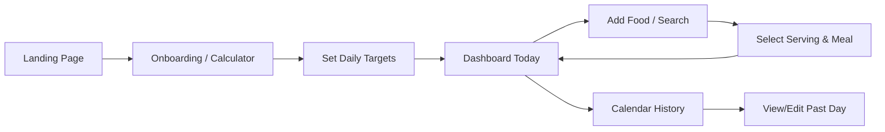

# Calzy — Architectural & Technical Explanation

This document explains in clear, plain language how Calzy is designed, how each component functions, how data moves through the application, and the engineering rationale behind Phase 0.

---

## 1. Plain-English Product Overview

**Calzy** is a nutrition tracker built specifically for mobile screens. While many existing fitness apps are overwhelmed by ads, social feeds, and confusing meal logs, Calzy focuses on three core principles:
1. **Accurate Calorie Targets**: Calculate your Basal Metabolic Rate (BMR) and Total Daily Energy Expenditure (TDEE) using established scientific formulas (Mifflin-St Jeor), not arbitrary guesses.
2. **Effortless Food Logging**: Search foods quickly and choose portions using intuitive, human-friendly units (such as "1 roti", "2 eggs", "1 cup", or exact grams).
3. **Clear Daily & Historical Visibility**: See daily progress with a central calorie ring and macronutrient bars, and jump back to any previous day on a calendar to view historical logs.

Calzy presents nutritional facts as standardized estimates and clearly conveys that it is a wellness tool, not medical advice.

---

## 2. End-to-End User Flow



1. **First-Time Discovery**: The user lands on the mobile-first Calzy home screen.
2. **Onboarding & Calculator**: The user inputs basic personal stats: age, gender, height (cm), weight (kg), activity level, and health goal (maintain, lose, or gain).
3. **Target Snapshot Creation**: The app calculates maintenance calories and daily macro targets (protein, carbohydrates, fats). These targets are saved as an immutable snapshot for that date.
4. **Active Dashboard**: The dashboard displays today's calorie ring (calories consumed vs. target vs. remaining), macronutrient progress bars, and categorized meal cards (Breakfast, Lunch, Snacks, Dinner).
5. **Adding Food**: The user taps "+ Add Food", searches by name, picks a food item, selects a pre-defined serving or custom weight, selects a meal category, and logs it.
6. **Instant Progress Update**: Dashboard stats update immediately to reflect the new meal item.
7. **Calendar Exploration**: Users can navigate back to previous dates to audit what they ate, check compliance, and make retro-active edits without altering other days.

---

## 3. Frontend Architecture

The frontend is built using **Next.js (App Router)** with **TypeScript** and **Tailwind CSS**.

### Why These Core Components Exist
- **`AppShell` (`src/components/layout/AppShell.tsx`)**:
  - *Problem*: Mobile apps look stretched, awkward, and unnatural when viewed full-width on ultra-wide desktop monitors.
  - *Solution*: `AppShell` acts as a responsive viewport container. On mobile phones, it naturally fills 100% of the screen. On desktop or tablet screens, it smoothly centers itself with a max width (440px–640px) and soft elevation shadows, mimicking a clean smartphone screen while maintaining responsive utility.
- **`Navbar` (`src/components/layout/Navbar.tsx`)**:
  - Provides instant brand recognition (Calzy logo with emerald leaf badge), system status indicator, and quick-action access.
- **`Footer` (`src/components/layout/Footer.tsx`)**:
  - Displays legal disclaimers ("Not medical advice"), version numbering, and copyright information while staying unobtrusive on mobile viewports.
- **Design Tokens (`src/lib/tokens.ts` & `src/app/globals.css`)**:
  - Centralizes our visual design system:
    - **Primary Accent**: Emerald green (`#10B981` / `#059669`) symbolizing vitality and health.
    - **Supporting Accents**: Teal / Cyan (`#0D9488`) for cool secondary actions.
    - **Surfaces**: Off-white background canvas (`#F8FAFC`) paired with crisp white card surfaces (`#FFFFFF`).
    - **Radiuses**: High-curvature rounded corners (`rounded-2xl` and `rounded-3xl`) for an inviting, tactile mobile feel.

---

## 4. Backend Architecture & API Responsibilities

The backend is built with **FastAPI** (Python 3.14) and served via **Uvicorn**.

### Why FastAPI?
- **High Performance**: Asynchronous Python API framework with native OpenAPI documentation (`/docs`).
- **Data Validation**: Powered by **Pydantic v2**, ensuring that incoming requests and outgoing payloads strictly match typed schemas.
- **Isolation of Nutrition Calculations**: Mathematical formulas (BMR, TDEE, macronutrient distributions, unit gram scaling) reside in tested backend modules rather than being duplicated across client devices.

### API Responsibilities
- **`/health`**: Reports system health, service name, version, and server UTC timestamps.
- **`/api/v1/calculator`** *(Phase 3)*: Evaluates Mifflin-St Jeor formulas and calculates personalized caloric allowances.
- **`/api/v1/foods`** *(Phase 4 & 5)*: Search and pagination across normalized food items and their standardized serving sizes.
- **`/api/v1/meals`** *(Phase 6 & 7)*: Creates meal logs and stores immutable nutrition snapshots for historical accuracy.

---

## 5. Database Model (PostgreSQL / Supabase)

The application architecture utilizes PostgreSQL with the following core relational design:

| Table | Key Fields | Purpose |
| :--- | :--- | :--- |
| `users` | `id`, `email`, `created_at` | Supabase Auth identity. |
| `user_profiles` | `user_id`, `age`, `gender`, `height_cm`, `weight_kg`, `activity_level`, `goal` | Stores user attributes for calculator inputs. |
| `daily_targets` | `user_id`, `effective_date`, `calorie_target`, `protein_g`, `carbs_g`, `fat_g` | **Snapshot table**: Preserves the user's target on any given date. If a user changes their goal next month, their historical logs still show the original target they were aiming for back then. |
| `foods` | `id`, `name`, `category`, `source`, `external_id`, `brand`, `default_unit` | Canonical food catalog (USDA, Indian Food Composition). |
| `food_nutrition` | `food_id`, `basis_grams` (e.g. 100g), `calories`, `protein_g`, `carbs_g`, `fat_g`, `fiber_g`, `micronutrients` | Normalized nutrition values per 100 grams. |
| `servings` | `id`, `food_id`, `label`, `grams`, `unit_type`, `quantity` | Real-world portions (e.g. "1 medium egg = 50g", "1 roti = 35g", "1 cup cooked dal = 200g"). |
| `meals` | `id`, `user_id`, `meal_type`, `date`, `consumed_at` | Groups entries into Breakfast, Lunch, Snacks, or Dinner for a specific date. |
| `meal_items` | `id`, `meal_id`, `food_id`, `serving_id`, `quantity`, `grams`, `nutrition_snapshot` | The actual food logged. Stores an immutable JSON snapshot of the calculated nutrition so future catalog edits never distort historical diaries. |
| `favorites` | `user_id`, `food_id` | Fast access to a user's most frequent food items. |

---

## 6. How Calorie / BMR / TDEE Calculations Work

Calzy uses the **Mifflin-St Jeor Equation**, widely considered by nutritionists and clinical studies as one of the most reliable methods for estimating Basal Metabolic Rate (BMR):

$$\text{BMR}_{\text{male}} = 10 \times \text{weight (kg)} + 6.25 \times \text{height (cm)} - 5 \times \text{age (years)} + 5$$

$$\text{BMR}_{\text{female}} = 10 \times \text{weight (kg)} + 6.25 \times \text{height (cm)} - 5 \times \text{age (years)} - 161$$

### Total Daily Energy Expenditure (TDEE)
$$\text{TDEE} = \text{BMR} \times \text{Activity Multiplier}$$

- **Sedentary** (little or no exercise): $1.2$
- **Lightly active** (exercise 1–3 days/week): $1.375$
- **Moderately active** (exercise 3–5 days/week): $1.55$
- **Very active** (hard exercise 6–7 days/week): $1.725$
- **Extra active** (physical job or 2x training): $1.9$

Goal adjustments:
- **Maintenance**: Target = TDEE
- **Weight Loss**: Target = TDEE - 500 kcal/day (~0.5 kg loss/week)
- **Weight Gain**: Target = TDEE + 300 to 500 kcal/day

---

## 7. How Food Quantities Convert to Nutrition Values

All canonical food items are stored normalized to **100 grams** in `food_nutrition`.

When a user selects a portion:
1. If the user selects a portion in grams:
   $$\text{scaled\_nutrient} = \text{nutrient\_per\_100g} \times \frac{\text{selected\_grams}}{100}$$
2. If the user selects a predefined unit (e.g. 2 rotis):
   - The serving record defines 1 roti = 35 grams.
   - Total grams = $2 \times 35\text{g} = 70\text{g}$.
   - The same normalization formula is applied: $\frac{70}{100} \times \text{nutrient\_per\_100g}$.

This architecture ensures that regardless of whether food is logged by the egg, piece, cup, or gram, the calculation engine is identical, transparent, and verifiable.

---

## 8. How Meal Totals and Dashboard Progress are Computed

1. **Daily Aggregation**:
   $$\text{Total Daily Calories} = \sum_{\text{all meals}} \sum_{\text{items in meal}} \text{item.calories}$$
2. **Remaining / Overage Handling**:
   $$\text{Remaining Calories} = \text{Target} - \text{Consumed}$$
   - When $\text{Consumed} \le \text{Target}$, the ring shows percent filled and remaining calories.
   - When $\text{Consumed} > \text{Target}$, the UI shifts to an overage state (warning amber/red accent) showing clearly how many calories over target the user is, rather than breaking or clamping invisibly.
3. **Macro Progress**:
   - Each macro (Protein, Carbs, Fat) computes:
     $$\text{Percent} = \min\left(100, \frac{\text{Consumed (g)}}{\text{Target (g)}} \times 100\right)$$

---

## 9. How the Calendar Retrieves Historical Days

- The calendar queries the backend by **user ID and date range** (e.g. the first to the last day of the visible month):
  ```sql
  SELECT date, SUM(calories) as total_calories
  FROM meals
  JOIN meal_items ON meals.id = meal_items.meal_id
  WHERE meals.user_id = :user_id AND meals.date BETWEEN :start_date AND :end_date
  GROUP BY meals.date;
  ```
- This prevents pulling years of meal data at once, keeping mobile memory and network bandwidth low.
- Selecting any specific date then loads the detailed meal items for that date only.

---

## 10. Data Privacy & User Isolation

- **Supabase Row-Level Security (RLS)**: Every table containing user data (`user_profiles`, `meals`, `meal_items`, `favorites`, `weight_logs`) enforces PostgreSQL RLS policies where `auth.uid() = user_id`.
- Users can never query, mutate, or access other users' meal diaries or personal health metrics.
- Nutrition values in the database are factual nutritional datasets and do not store any personally identifiable information (PII).

---

## 11. What Was Implemented Across Phases

### Phase 0 — Foundation & Repository Rules
1. **Monorepo Separation**: Created `frontend/` (Next.js 15 App Router) and `backend/` (FastAPI) to ensure clear separation of concerns.
2. **Design Tokens**: Configured Tailwind CSS and CSS variables for an emerald health color palette (`#10B981`), surface elevation, and typography.
3. **Backend Skeleton**: Implemented `/health` and `/` endpoints with CORS middleware and Pytest test suite.
4. **Environment & Documentation**: Added `.env.example`, `README.md`, and this `EXPLANATION.md`.

### Phase 1 — UI Shell, Component Library & Navigation
1. **Strict Mobile-First Viewport**:
   - Refactored `AppShell.tsx` to enforce a clean mobile-first viewport centered on desktop displays (`max-w-[430px]`) without any switcher toggles or extra chrome.
2. **Accessible Component Library (`src/components/ui/`)**:
   - `CalorieRing`: Visual anchor of the dashboard. Computes SVG circle circumference dynamically, centers remaining calories, and gracefully transitions to a rose/red warning state when calories exceed daily target.
   - `MacroBar`: Horizontal metric cards for Protein, Carbs, and Fat showing current grams, targets, and percentage.
   - `MealCard`: Interactive cards for Breakfast, Lunch, Snacks, and Dinner with quick item expansion and "+ Add Food" shortcuts.
   - `DateHeader`: Reusable header with "‹ Previous Day", "Next Day ›", and "Today" date selectors.
   - `Card`, `Button`, `Input`, `ProgressBar`: Primitives with accessible touch targets (minimum 44px hit areas) and states.
   - `EmptyState`, `LoadingState`, `ErrorState`: Standardized state feedback components.
3. **Bottom Navigation (`BottomNav.tsx`)**:
   - 4-tab mobile bar linking to `/dashboard` (Today), `/add-food` (+), `/calendar`, and `/profile`.
   - Elevated center button for fast access to food logging.
4. **Page Shells**:
   - `/dashboard`: Active daily summary with interactive over-target simulation toggle.
   - `/add-food`: Real-time food filter, portion unit pills, custom gram weight input, and meal category assignment.
   - `/calendar`: Month grid showing adherence dots and daily summary audit.
   - `/profile`: Personal stats summary, Mifflin-St Jeor BMR & TDEE overview, and Phase 2 account placeholder.
5. **Mock Fixture Separation**:
   - All mock demonstration data is strictly isolated in `src/lib/mockData.ts` with explicit types, clearly demarcated as UI shell demonstration data.

### Phase 2 — Supabase Authentication & User Profile
1. **Supabase Client Architecture**:
   - Implemented `@supabase/ssr` with browser client (`client.ts`) and server client (`server.ts`) adhering to Next.js App Router best practices.
   - Session refresh and cookie synchronization configured in `middleware.ts`.
   - Graceful offline fallback: if Supabase environment variables are missing, the UI displays an informative connection banner instead of failing.
2. **PostgreSQL User Profiles & Strict Row-Level Security**:
   - Designed [001_create_user_profiles.sql](file:///c:/Users/ameri/OneDrive/Documents/Calzy/supabase/migrations/001_create_user_profiles.sql) creating `public.user_profiles` tied to `auth.users(id)`.
   - Enforced Row-Level Security (RLS) policies: users can only read, insert, and update rows where `auth.uid() = user_id`. User A can never access User B's profile data.
   - Built a PostgreSQL trigger (`on_auth_user_created`) that automatically initializes a profile stub whenever a user signs up.
3. **Authentication Flows**:
   - `/login`: Clean tabbed interface for Sign In and Sign Up with validation (email format, 6+ character password, full name for registration).
   - `/onboarding`: Multi-field questionnaire collecting personal stats (Age, Gender, Height, Weight, Activity Level, Goal).
   - `/profile`: Reflects authenticated session, allows profile updates, and includes a working Sign Out action.
   - `Navbar`: Displays live authenticated user avatar/email with quick links.

### Phase 3 — Calorie Calculator & Daily Targets
1. **Mifflin-St Jeor Calculation Engine (`backend/app/services/calculator.py`)**:
   - Implemented an isolated, deterministic calculator service:
     - Male: $10 \times \text{weight} + 6.25 \times \text{height} - 5 \times \text{age} + 5$
     - Female: $10 \times \text{weight} + 6.25 \times \text{height} - 5 \times \text{age} - 161$
     - Other: $10 \times \text{weight} + 6.25 \times \text{height} - 5 \times \text{age} - 78$
2. **Explicit Activity Multipliers**:
   - Defined structured configuration mapping `sedentary` (1.200x), `light` (1.375x), `moderate` (1.550x), `active` (1.725x), and `very_active` (1.900x), preventing magic numbers across the codebase.
3. **Goal Adjustment & Scientific Safety Floors**:
   - Weight Loss: 500 kcal daily deficit (~0.5 kg loss/week).
   - Weight Gain: 350 kcal daily surplus (lean mass gain).
   - Enforced hard safety calorie floors: male $\ge 1500$ kcal, female $\ge 1200$ kcal, other $\ge 1350$ kcal to protect basal metabolic health.
4. **Evidence-Based Macronutrient Distribution**:
   - Protein: 2.0g per kg of body weight (capped at 35% of total calories).
   - Fat: 0.9g per kg of body weight (20% to 35% range).
   - Carbohydrates: Remainder of total calories divided by 4 kcal/g.
   - Guaranteed energy balance check: $(P \times 4) + (C \times 4) + (F \times 9) \approx \text{Total Calories}$.
5. **Daily Target Snapshots (`supabase/migrations/002_create_daily_targets.sql`)**:
   - Built the `daily_targets` table in PostgreSQL. When a user calculates or updates goals, a target snapshot is recorded for that effective date.
   - Historical records remain completely immutable and tied to their original date, ensuring past diary entries never distort.
6. **Onboarding Result Screen (`/onboarding/result`)**:
   - Presents maintenance calories (TDEE) and goal-adjusted target calories side-by-side with scientific explanations.
   - Displays gram targets and calorie contributions for Protein, Carbs, and Fat.
   - Persists snapshot to Supabase and seamlessly transitions to `/dashboard`.
7. **Comprehensive Pytest Suite**:
   - Added 7 dedicated unit tests (`backend/tests/test_calculator.py`) validating deterministic vectors, activity factors, macro balance, safety floors, and FastAPI REST endpoint validation.

### Phase 4 — Food Database and Nutrition Import Pipeline
1. **Relational Nutrition Schema (`supabase/migrations/003_create_food_catalog.sql`)**:
   - Designed normalized tables with clear separation of concerns:
     - `foods`: Canonical food metadata (`name`, `category`, `source`, `external_id`, `brand`, `default_unit`).
     - `food_nutrition`: Normalized strictly to a **100-gram basis** (`calories`, `protein_g`, `carbs_g`, `fat_g`, `fiber_g`, `sugar_g`, `sodium_mg`, and `micronutrients` JSONB).
     - `servings`: Human-friendly portion sizes mapped to exact calibrated gram equivalents (e.g., "1 medium roti = 35g", "1 large egg = 50g", "1 standard katori dal = 150g").
   - Added search indexes (`idx_foods_name`, `idx_foods_category`, `idx_foods_external_id`) and enabled Row-Level Security with public read policies (`SELECT true`).
2. **Authoritative, Non-Fabricated Seed Dataset (`backend/data/seed_foods.json`)**:
   - Built an authoritative 21-item verified foundation containing:
     - **USDA FoodData Central (FDC)**: Standard reference foundation items (Chicken Breast `FDC:171077`, Whole Egg `FDC:171287`, Brown Rice `FDC:169704`, Rolled Oats `FDC:173904`, Greek Yogurt `FDC:170903`, Almonds `FDC:170567`, Apple `FDC:171688`, Banana `FDC:173944`, Broccoli `FDC:170379`, Spinach `FDC:168462`, Peanut Butter `FDC:172470`, Salmon `FDC:173686`, Whole Cow Milk `FDC:171265`).
     - **ICMR-NIN Indian Food Composition Tables (IFCT 2017)**: Public scientific domain values for Indian staples (Roti/Chapati `IFCT:B005`, Paneer `IFCT:F008`, Yellow Moong Dal `IFCT:B033`, Basmati White Rice `IFCT:A009`, Dahi/Curd `IFCT:F004`, Chickpeas/Chana `IFCT:B008`, Masoor Dal `IFCT:B032`, Cow Ghee `IFCT:F011`).
   - Every single entry is strictly attributed to its official catalog ID and published 100g chemical composition.
3. **Repeatable, Idempotent Import Engine (`backend/app/services/food_importer.py`)**:
   - Converts external IDs into deterministic UUIDv5 identifiers under a dedicated Calzy namespace (`uuid.uuid5(FOOD_CATALOG_NAMESPACE, f"food:{external_id}")`). Repeated imports never duplicate records or create conflicting identifiers.
   - Enforces 100g normalization: if raw data arrives with a non-100g basis (e.g., a 30g supplement scoop), the importer scales all values using $(100.0 / \text{basis\_grams})$.
   - Validates non-negative macronutrients and approved source provenance (`VALID_SOURCES`).
4. **FastAPI Food Catalog Endpoints (`backend/app/api/v1/endpoints/foods.py`)**:
   - `GET /api/v1/foods/search?q={query}&category={category}&limit={limit}`: Fast substring search with category filtering and macro preview.
   - `GET /api/v1/foods/categories`: Distinct list of catalog categories.
   - `GET /api/v1/foods/{food_id}`: Full item detail including 100g facts and all available serving units.
   - `GET /api/v1/foods/{food_id}/scale?grams={g}`: Mathematical endpoint computing exact scaled nutrition for any given gram mass.
5. **Interactive Frontend Verification (`/add-food`)**:
   - Updated the Add Food screen to query the verified catalog.
   - Users can search ("roti", "paneer", "chicken"), filter by category chips, select calibrated portion chips, or type custom gram weights.
   - Dynamically calculates scaled calories, protein, carbs, fat, and fiber with immediate feedback.
6. **Robust Pytest Suite (24/24 Passing)**:
   - Added 14 unit tests in `backend/tests/test_foods.py` verifying deterministic UUID stability, 100g normalization, source validation, negative value rejection, search ranking, serving portion scaling, and HTTP REST endpoint contracts.

---

## 12. Known Tradeoffs & Assumptions

- **100g Standardization**: All nutrition calculations anchor to 100 grams. While some commercial brands report per-serving (e.g. per 2 biscuits or 1 packet), normalizing to 100g provides an invariant baseline that allows comparing any food item on equal footing.
- **Portion Approximations**: Serving sizes (such as "1 medium roti = 35g" or "1 katori dal = 150g") represent standard dietary guidelines from ICMR-NIN. For maximum precision, users can enter exact weighed gram quantities via the custom weight input.
- **Offline Self-Sufficiency**: The core seed catalog is bundled locally in `seed_foods.json` and mirrored in `003_create_food_catalog.sql` so that local development and automated testing require zero external API dependencies or paid subscription keys.
- **Phase 5 Boundary**: Phase 5 will focus on debounced search UX, favorite toggling, and rich micro-nutrient modals before persistent meal diary logging is introduced in Phase 6.


